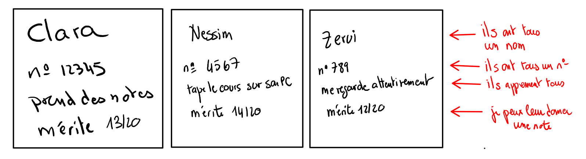
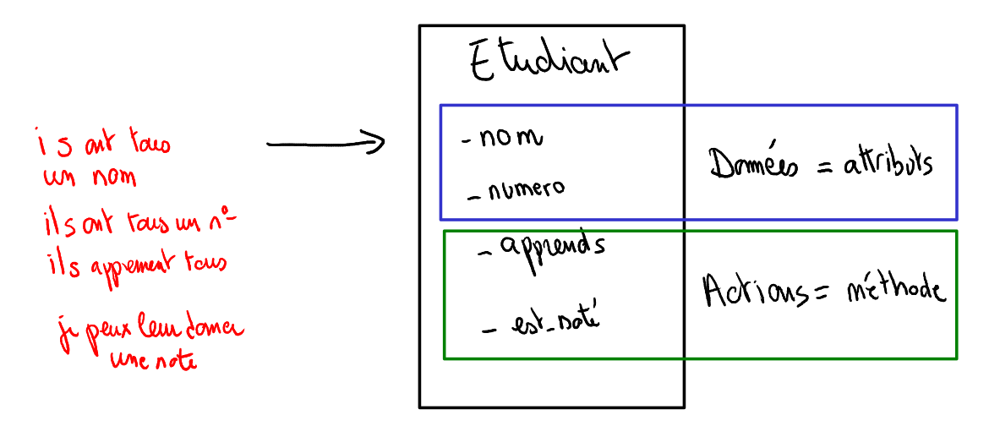
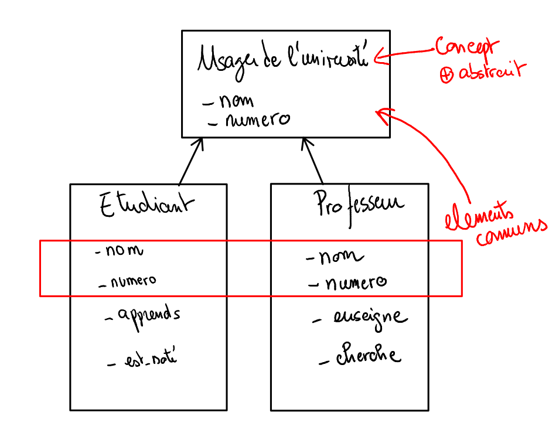

# Caractéristiques du langage Java

## Modèle de typage de Java

Java à deux propriétés qui le diffèrencie fortement de Python:

- fortement typée: il faut déclarer les variables et leur donner un type
- à typage statique: le type d'une variable restera toujours le même pendant sa durée de vie

Exemple python:

```python
j="string" # ici le type de j est déterminé lors de l'affectation
for i in range(0,10): #ici i est utilisée sans avoir été déclarée
    j=i*2  #ici j est affectée sans avoir été déclarée
print(j) #j=18
```

l'équivalent en Java:

```java
int j=0; // ici j est définie comme un entier, il le restera toute sa vie
for(int i=0;i<10;i++){ //ici j est définie comme un entier, il le restera tant qu'on est dans la boucle for
    j=i*2;
}
System.out.println(j); //ici on  au
```

## Paradigme de programmation JAVA

Java est un language de programmation impératif (composé d'instructions) et multi-paradigme (c'est à dire qui supporte différentes façons de coder la même chose):

- *La programmation orientée Objet*: regroupe le code et les données au même endroit dans un concept appellé **Classes**
- *La programmation fonctionnelle*: considère les opérations comme des suites de fonctions dont les sorties sont les entrées d'autres fonctions
- *Reactif*: les flux de données peuvent être traités de façon séquentielle et en temps réel par rapport à leur utilisation

### Les caractéristiques communes des étudiants

Les classes permettent de structurer vos programmes de la même façon que votre cerveau appréhende le monde existant. Lorsque je vois un groupe d'étudiant, mon cerveau, instinctivement comprends que ceux-ci ont des caractéristiques communes (comme tous les étudiants):

* ils ont tous un numéro étudiants
* ils peuvent apprendre
* en temps qu'enseignant je peux leur donner des notes




### Naissance de la classe des étudiants

Je regroupe toutes les caractéristiques des étudiants, sous forme d'un concept abstrait appellé `classe`



Une classe comporte 2 types d'information:

* les attributs (les données, des variables qui sont propres à chaque objet)
* les méthodes (le code exécuté, qui est exécuté de la même manière pour chaque étudiant)

### Abstraction supplémentaire avec les professeurs

Si je vois un collègue enseignant, je sais également qu'il fait parti de la "classe" des enseignants et que je peux le tutoyer, lui demander quels sont ses sujets de recherche et les cours qu'il donne (comme tous les enseignants).

Je vois également qu'un enseignant et qu'un étudiant ont des caractéristiques communes: ils ont tous les deux un num et un numéro d'identifiant dans l'université



On voit donc qu'il exsite un concept *plus abstrait* dans notre modèle `Usager de l'université` qui regroupes les caractéristiques communes des deux classes.

<iframe src="https://java.miage.dev/?snipId=573572bc-5025-41b5-ad6e-679be4315391" width="100%" height="800" frameborder="0" marginwidth="0" marginheight="0" allowfullscreen></iframe>
