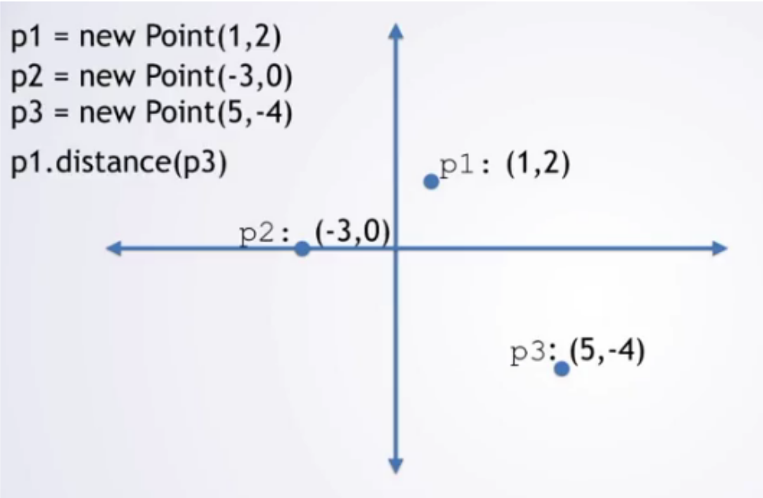

# La classe Point
Comme dit précédemment, les objets représentent des individus concrèts issue de *classes* qui sont des concepts abstraits à partir desquels les individus sont crées.

Dans les programmes java, les classes contiennent des *données* (les attributs) et du *code* (les méthodes). Cette façon de découper est très utile pour les programmes ayant beaucoup de fonctionnalités.

Nous allons maintenant créer notre première classe, la classe des **Points** qui va nous permettre de manipuler aussi bien les points du plan que les formes géométriques.

## Quelques explications de syntaxe.

### Le constructeur

Un constructeur est une méthode spéciale qui ne retourne pas de valeur. Elle est utilisable uniquement avec le mot clé `new` qui permet de crée un nouvel objet. En général, le constructeur d'une classe intitialise les attributs de la classe à l'aide des paramètre passés aux constructeurs.
Le nom du constructeur est **toujours** identique à celui de la classe.

```java
public class Voiture{

    //ceci est une déclaration d'un attribut entier représentant la vitesse d'une voiture
    int vitesse;

    //ceci est un constructeur qui prend un paramètre entier
    public Voiture(int laVitesse){
        //ici, on affecte la valeur laVitesse à l'attribut vitesse
        vitesse=laVitesse;
    }

    public static void main(String ...args){
        Voiture v = new Voiture(50); //je crée une nouvelle voiture dont la vitesse est de 50.
        Voiture alpha = new Voiture(20); //cette autre voiture roule moins vite
    }

    
}

```

### La portée des attributs et des méthodes

Les attributs d'une classes représentent son état interne. Il doit être en général "caché" à ceux qui utilisent la classe, afin qu'ils ne puissent pas y accéder en modification. La façon de faire en java est de spécifier un mot clé supplémentaire lors de la déclaration de l'attribut: le mot clé **private**.
Celui-ci nous dit qu'il sera impossible, pour une autre classe que celle où l'attribut est déclaré d'accéder à la valeur de l'attribut.

Les méthodes d'une classes représentent les opérations qu'on peut réaliser sur les objets. Ils sont en général "exposé" à ceux qui utilise la classe, afin qu'ils puisse s'en servir sur l'objet. Le mot clé **public** permet de rendre les méthodes accessibles à tous.

> Dans notre cours, les attributs seront toujours *private* et les méthodes toujours *public*
>

### Accéder aux attributs et aux méthodes

Quand vous avez un objet, vous devez pouvoir accéder aux attributs et aux méthodes. Par exemple, une méthode doit pouvoir accéder aux attributs de l'objets et la personne qui a crée l'objet doit pouvoir appeller les méthodes.
Pour cela il faut utiliser l'opérateur `.` (point). Cet opérateur, lorsqu'il est appliqué sur un objet, permet d'accéder aux attributs et aux méthodes de cet objet.

```java

public class Voiture{

    //ceci est une déclaration d'un attribut entier représentant la vitesse d'une voiture
    int vitesse;

    //ceci est un constructeur qui prend un paramètre entier
    public Voiture(int laVitesse){
        //ici, on affecte la valeur laVitesse à l'attribut vitesse
        vitesse=laVitesse;
    }

    public int getVitesse(){
        return vitesse;
        //return this.vitess // une autre façon d'accéder aux attribiuts de l'objet en cours: les faires précéder du mot-clé this qui représente l'objet en cours (comme le self de python)
    }

    public static void main(String ...args){
        Voiture v = new Voiture(30);
        int vitesse = v.getVitesse(); //permet d'appeller la méthode vitesse() depuis l'objet v
    }

    
}


```

### Exo1



<iframe src="https://java.miage.dev?gistId=2c0d305cfba4c2e7b60aae8b92ef6fd1" width="100%" height="800" frameborder="0" marginwidth="0" marginheight="0" allowfullscreen></iframe>

