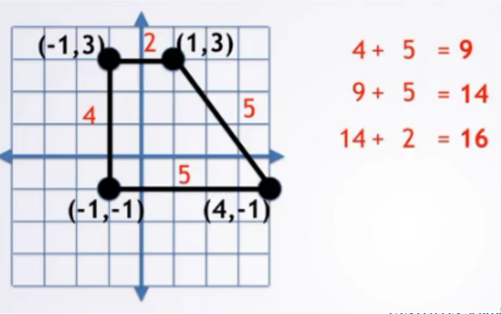
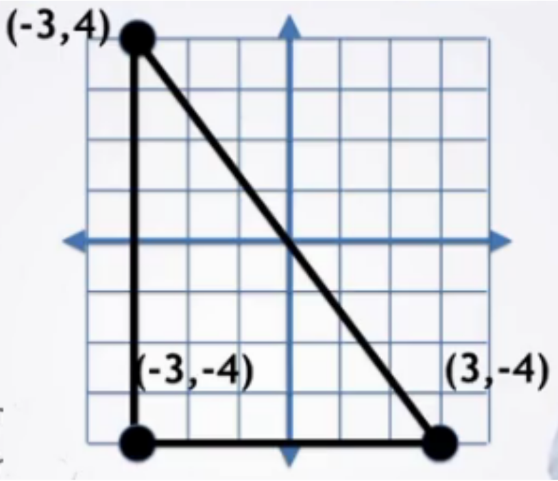

L'objectif de cette section est de savoir comment, à partir de l’énoncé d'un problème, parvenir à l'écriture de code.

# Les 7 étapes

1. Dérouler un exemple à la main
2. Écrire ce que vous avez fait
3. Trouver des modèles
4. Vérifier vos modèles à la main
5. Traduire en code
6. Vérifier avec des cas de test
7. Débugger les cas erronés

## Application au calcul du périmètre

Problème: pour une forme, calculer son périmètre.

### Etape 1 : Dérouler un exemple

### Etape 2 : Ecrire ce que vous avez fait

1. Trouver la distance du 1ier point au 2ième point (c'était 4 )
2. Trouver la distance du 2ième point au 3ième point (c'était 5 )
3. Ajouter **4+5=9**
2. Trouver la distance du 3ième point au 4ième point (c'était 5 )
3. Ajouter **9+5=14**
2. Trouver la distance du 4ième point au 1ier point (c'était 2 )
3. Ajouter **14+2=16**
5. 16 était la réponse

### Etape 3 : Généraliser

#### Première Généralisation

1. Trouver la distance du 1ier point au 2ième point (c'était 4 )
1. Ajouter **0+4=4**
2. Trouver la distance du 2ième point au 3ième point (c'était 5 )
3. Ajouter **4+5=9**
2. Trouver la distance du 3ième point au 4ième point (c'était 5 )
3. Ajouter **9+5=14**
2. Trouver la distance du 4ième point au 1ier point (c'était 2 )
3. Ajouter **14+2=16**
5. 16 était la réponse

#### DEuxième Généralisation

1. Trouver la distance du 1ier point au 2ième point, l’appeler **currentDist**
1. Ajouter **0+currentDist=4**
2. Trouver la distance du 2ième point au 3ième point, l’appeler **currentDist**
3.  **totalPerim**  = **totalPerim** + **currentDist**
2. Trouver la distance du 3ième point au 4ième point, l’appeler **currentDist**
3.  **totalPerim**  = **totalPerim** + **currentDist**
2. Trouver la distance du 4ième point au 1ier point, l’appeler **currentDist**
3.  **totalPerim**  = **totalPerim** + **currentDist**
5. **totalPerim** est  la réponse

#### Troisième généralisation

0. initialiser **totalPerim**  = 0
1. Trouver la distance du 1ier point au 2ième point, l’appeler **currentDist**
3.  **totalPerim**  = **totalPerim** + **currentDist**
2. Trouver la distance du 2ième point au 3ième point, l’appeler **currentDist**
3.  **totalPerim**  = **totalPerim** + **currentDist**
2. Trouver la distance du 3ième point au 4ième point, l’appeler **currentDist**
3.  **totalPerim**  = **totalPerim** + **currentDist**
2. Trouver la distance du 4ième point au 1ier point, l’appeler **currentDist**
3.  **totalPerim**  = **totalPerim** + **currentDist**
5. **totalPerim** est  la réponse

#### Quatrième généralisation

0. initialiser totalPerim  = 0
1. Trouver la distance du 1ier point au **2ième** point, l’appeler currentDist
3.  totalPerim  = totalPerim + currentDist
2. Trouver la distance du 2ième point au **3ième** point, l’appeler currentDist
3.  totalPerim  = totalPerim + currentDist
2. Trouver la distance du 3ième point au **4ième** point, l’appeler currentDist
3.  totalPerim  = totalPerim + currentDist
2. Trouver la distance du 4ième point au **1ier** point, l’appeler currentDist
3.  totalPerim  = totalPerim + currentDist
5. totalPerim est  la réponse

#### Cinquième généralisation

0. initialiser totalPerim  = 0
2. Trouver la distance du 4ième point au **1ier** point, l’appeler currentDist
3.  totalPerim  = totalPerim + currentDist
1. Trouver la distance du 1ier point au **2ième** point, l’appeler currentDist
3.  totalPerim  = totalPerim + currentDist
2. Trouver la distance du 2ième point au **3ième** point, l’appeler currentDist
3.  totalPerim  = totalPerim + currentDist
2. Trouver la distance du 3ième point au **4ième** point, l’appeler currentDist
3.  totalPerim  = totalPerim + currentDist
5. totalPerim est  la réponse

#### Sixième généralisation

0. initialiser totalPerim  = 0
2. Trouver la distance du 4ième point au 1ier point, l’appeler currentDist
3. totalPerim  = totalPerim + currentDist
4. Mettre à jour **prevPoint** = 1ier point
1. Trouver la distance de PrevPoint  au 2ième point, l’appeler currentDist
3. totalPerim  = totalPerim + currentDist
4. Mettre à jour **prevPoint** = 2iem point
1. Trouver la distance de PrevPoint  au 3ième point, l’appeler currentDist
3. totalPerim  = totalPerim + currentDist
4. Mettre à jour **prevPoint** = 3ieme point
1. Trouver la distance de PrevPoint  au 4ième point, l’appeler currentDist
3. totalPerim  = totalPerim + currentDist
5. totalPerim est  la réponse

#### 7e généralisation

0. initialiser totalPerim  = 0
2. Trouver la distance du **4ième** point au 1ier point, l’appeler currentDist
3. totalPerim  = totalPerim + currentDist
4. Mettre à jour prevPoint = 1ier point
1. Trouver la distance de PrevPoint  au 2ième point, l’appeler currentDist
3. totalPerim  = totalPerim + currentDist
4. Mettre à jour prevPoint = 2iem point
1. Trouver la distance de PrevPoint  au 3ième point, l’appeler currentDist
3. totalPerim  = totalPerim + currentDist
4. Mettre à jour prevPoint = 3ieme point
1. Trouver la distance de PrevPoint  au 4ième point, l’appeler currentDist
3. totalPerim  = totalPerim + currentDist
4. Mettre à jour prevPoint = 4ieme point
5. totalPerim est  la réponse

#### 8e généralisation

0. initialiser totalPerim  = 0
0. Initialiser prevPoint = dernier point

2. Trouver la distance du prevPoint point au **1ier point**, l’appeler currentDist
3.  totalPerim  = totalPerim + currentDist
4. Mettre à jour prevPoint = **1ier point**

1. Trouver la distance de PrevPoint  au **2ième point**, l’appeler currentDist
3.  totalPerim  = totalPerim + currentDist
4. Mettre à jour prevPoint = **2iem point**

1. Trouver la distance de PrevPoint  au **3ième point**, l’appeler currentDist
3.  totalPerim  = totalPerim + currentDist
4. Mettre à jour prevPoint = 3ieme point

1. Trouver la distance de PrevPoint  au **4ième point**, l’appeler currentDist
3.  totalPerim  = totalPerim + currentDist
4. Mettre à jour prevPoint = **4ieme point**

5. totalPerim est  la réponse

#### 9e généralisation

* initialiser totalPerim  = 0
* Initialiser prevPoint = dernier point
* Pour chaque point **currPt** dans la forme
  * Trouver la distance de PrevPoint  au **currPt** point, l’appeler currentDist
  * totalPerim  = totalPerim + currentDist
  * Mettre à jour prevPoint = **currPt**
* totalPerim est  la réponse

### Tester sur une autre instance

# TD Périmètre

<iframe src="https://java.miage.dev?gistId=79346707a25c59b67e8ee3aa38b9f9cd" width="100%" height="800" frameborder="0" marginwidth="0" marginheight="0" allowfullscreen></iframe>
