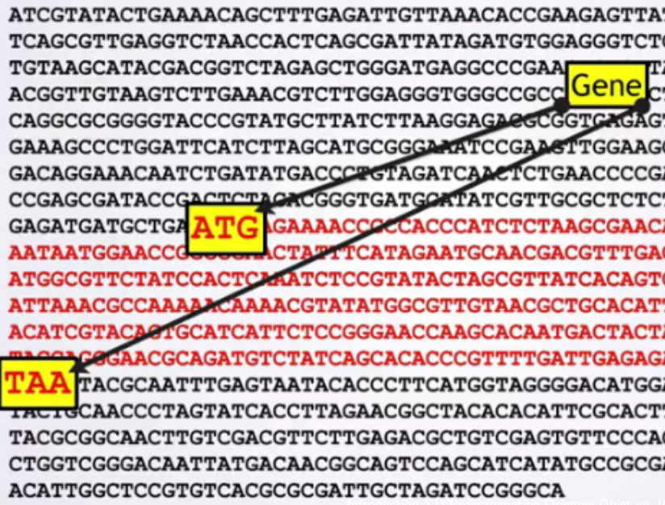
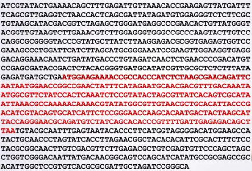
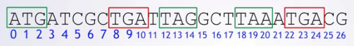

# Les Chaînes de caractère

## Notre fil rouge: le code ADN en tant que Chaîne

Les informations du génomes sont stockées à l’aide d’un alphabet de 4 lettres ATCG 
1. Adenine
2. Thymine
3. Cytosine
4. Guanine

> TGGGAATAGTACGGGGATTCAATGGTACCAGTATAGC

Le Génome est composé de paires de ces nucléotiques (environ 3.10ˆ9). Des algorithmes de recherche de gènes sont indispensable pour exploiter l’information contenue dans notre ADN.



## Pourquoi travailler avec les Chaînes (String) 

Les chaines de caractères ne sont pas un type primitif, mais elles restent un type Objet très important pour le language. Elle peuvent contenir n'importe quel type de caractère:

* des lettres
* des chiffres
* des ponctuations

### Extrait du gène MSH2 chez l'être humain

source: [https://www.ncbi.nlm.nih.gov](https://www.ncbi.nlm.nih.gov/nuccore/NC_000002.12?report=fasta&from=47403067&to=47709830)

> Homo sapiens chromosome 2, GRCh38.p14 Primary Assembly
> AAGCTGATTGGGTGTGGTCGCCGTGGCCGGACGCCGCTCGGGGGACGTGGGAGGGGAGGCGGGAAACAGC
> TTAGTGGGTGTGGGGTCGCGCATTTTCTTCAACCAGGAGGTGAGGAGGTTTCGACATGGCGGTGCAGCCG
> AAGGAGACGCTGCAGTTGGAGAGCGCGGCCGAGGTCGGCTTCGTGCGCTTCTTTCAGGGCATGCCGGAGA
> AGCCGACCACCACAGTGCGCCTTTTCGACCGGGGCGACTTCTATACGGCGCACGGCGAGGACGCGCTGCT
> GGCCGCCCGGGAGGTGTTCAAGACCCAGGGGGTGATCAAGTACATGGGGCCGGCAGGTGAGGGCCGGGAC
> GGCGCGTGCTGGGGAGGGACCCGGGGCCTTGTGGCGCGGCTCCTTTCCCGCCTCAGAGAGTGGGCGGTGA
> GCAGCCTCTCCAGTGCGGAGGCACGGGGGCGGAACGTTGGTGCTTGTGCGGATTCCGCCGTCCCCAGGTT
> CTGCTTGGCTCCGGAGGGACGCCCCCCTCAGCCCTGAAACCCGTGCCTCTCCAGCCGCCCCGGATCTGAA
> CTTGTGATCACGGAGTGTTTACGTCGTGCCAGGCATTTTAATGCATTGTTCTAGTTCATTTTCCAGCAGT
> CGCATTCCTCGCCTTGGCCCTACATGTAGCGCTCATTACAAACACGGCCAGAATCTCTTATTAACAAACA
> GCAGCCAGGAGTGAGATTTAAAATAGACTGGGGGTTTAGGAGACCCTTTTATGACACGTAATTCTGCTCC

### Une réponse à une requète HTTP 

> < HTTP/2 304 
> < date: Wed, 04 Oct 2023 23:17:42 GMT
> < via: 1.1 varnish
> < cache-control: max-age=600
> < etag: W/"6464c0c3-271e"
> < expires: Wed, 04 Oct 2023 23:27:00 GMT
> < age: 2
> < x-served-by: cache-par-lfpg1960062-PAR
> < x-cache: HIT
> < x-cache-hits: 1

### Un document XML

```xml
<LinkedHashMap><price>39.0</price><productType>LUXURY</productType></LinkedHashMap>
```

## Objectifs de cette phase du cours

Dans cette phase, nous allons tâcher de comprendre la classe [String](https://docs.oracle.com/en/java/javase/21/docs/api/java.base/java/lang/String.html) présente dans le JDK21.

La classe String présente de nombreuses méthodes utilisées pour manipuler des chaines de caractères et dispose de nombreuses méthodes très utiles. Nous allons étudier seulement une partie des méthodes de la classe String, mais vous pouvez vous référer à la documentation en ligne pour en savoir plus.

Nous en profiterons pour en apprendre plus sur les types Java, notemment les types numériques et les opérateurs.
  
Et finalement nous aborerons la création de programme pour programmes pour découvrir des patterns et de l'information dans des Strings (e.g. tous les liens sur une page web? quels sont tous les gènes dans un brin d'ADN?)


# Les Strings avec l'ADN

## Travailler avec des Strings représentant de l'ADN

Nous allons commencer par chercher des gènes dans des Strings. Ceci est un exemple réel (mais très simplifié) d'une recherche de pattern dans une chaine de caractère. Vous pourrez généraliser cette approche avec n'importe quelle application, telle que les pages web, les emails et tout contenu textuel.

Nous aurons également une belle occasion d'appliquer à nouveau la méthode en 7 étapes.

LEs 4 lettres ATGC sont appellés les **nucléotides**. Ils sont les briques composant l'ADN. Un groupe de 3 nucléotides représente un codon.

### Etape 1

Hypothèses:

> * Début du gène : "start codon" *ATG*
> * Fin du gène : "stop codon" *TAA*
> * Gène: tous les codons entre un start codon et un stop codon (inclus)

| remarques il existe d'autre stop codon et les vrais gènes ne contiennent que des codons (donc leur longueur exprimée en nucléotide est un multiple de 3)

Nous allons réutiliser la [méthode en 7 étapes](methodes_7_etapes) pour écrire un algorithme permettant de trouver un gène. Pour cela, nous avons besoin de 3 nouveaux concepts:

* Comment trouver ATG dans une chaîne?
* Comment représenter les positions dans une chaîne?
* Comment obtenir toutes les lettres dans un intervalle?

### Comment représenter la position de quelque chose dans une chaîne?

* On peut utiliser les [tableaux en Java](https://java.l3.miage.dev/langage_java/tableau.html)

#### Exemples d'utilisation de tableau

<iframe src="https://java.miage.dev?gistId=49cfe81c72525e4add6214f5a4747a2e" width="100%" height="800" frameborder="0" marginwidth="0" marginheight="0" allowfullscreen></iframe>

#### Utilisation des tableaux de characters pour la recherche

Il est tout à fait possible de coder une fonction de recherche de pattern dans une chaine de characters en utilisant uniquement des tableaux. 
Il est toute fois préférable d'utiliser les méthodes prévues par la classe `String` car:

* elles seront optimisées par rapport à notre code, la pluspart du temps
* elles nous évitent de faire des erreurs car les tableaux sont fragiles

Notez l'utilisation de la classe [Character](https://docs.oracle.com/en/java/javase/21/docs/api/java.base/java/lang/Character.html) dans le code suivant:

<iframe src="https://java.miage.dev?gistId=815d56f4b61b756c3675c189faf92504" width="100%" height="800" frameborder="0" marginwidth="0" marginheight="0" allowfullscreen></iframe>

### la méthodes String.subString

Consultez la documentation de la méthode [substring](https://docs.oracle.com/en/java/javase/21/docs/api/java.base/java/lang/String.html#substring(int)) et comprenez son usage, puis testez la et répondez aux questions de l'extrait de code.

<iframe src="https://java.miage.dev?gistId=23e89686ba8a267cfc0227dce63f6303" width="100%" height="800" frameborder="0" marginwidth="0" marginheight="0" allowfullscreen></iframe>

### Autres méthodes que nous allons utiliser


* [public int length()](https://docs.oracle.com/en/java/javase/21/docs/api/java.base/java/lang/String.html%23length%28%29)
* [public int indexOf(int ch)](https://docs.oracle.com/en/java/javase/21/docs/api/java.base/java/lang/String.html#indexOf(int))
* [public int indexOf(int ch, int fromIndex)](https://docs.oracle.com/en/java/javase/21/docs/api/java.base/java/lang/String.html#indexOf(int,int))
* [public boolean startsWith(String prefix)](https://docs.oracle.com/en/java/javase/21/docs/api/java.base/java/lang/String.html#startsWith(java.lang.String))
* [boolean endsWith(String suffix)](https://docs.oracle.com/en/java/javase/21/docs/api/java.base/java/lang/String.html#endsWith(java.lang.String))

<iframe src="https://java.miage.dev?gistId=a00e413d8ae6563376065d3bc5906165" width="100%" height="800" frameborder="0" marginwidth="0" marginheight="0" allowfullscreen></iframe>

### Live Coding Recherche simple de gène

On cherche un volontaire

<iframe src="https://java.miage.dev?gistId=d0117c9d989a487bf8ea7ecbba2cbe5f" width="100%" height="800" frameborder="0" marginwidth="0" marginheight="0" allowfullscreen></iframe>

# Améliorons notre algorithme pour trouver plusieurs gènes

* Vous connaissez déjà la class FileResource du précédent TD
* l'utilisation des iterables vous a permis de facilement accéder aux données d'un fichier
* Nous allons utiliser le même principe d’itération dans cette partie.
* Idée: Utiliser le même algorithme que pour trouver 1 gène et répéter.
* Nous allons aussi présenter un nouvel itérable capable de stocker temporairement des informations.



## Des Outils supplémentaires: la boucle while et les ArrayList<>

* l'utilisation d'une boucle while infinie
* l'utilisation de la class ArrayList<String> (ajout de valeurs, comptage, filtrage )

Algorithme à implémenter

1. on trouve la première occurrence de ATG
2. on trouve le TAA après ATG
3. Vérifie que la distance est un multiplicateur de 3
4. ce n'est pas le cas, donc on trouve le prochain TAA

## Boucle While

* Combien de fois vérifier que la distance est bien un multiple de 3?
  * Dans le cas, général, on ne sait pas.
  * A la place on doit écrire un algo qui vérifie autant de fois que
   nécessaire.
* Les répétitions dans nos algo se transforment en boucle
  * il faut transformer nos répétitions en étapes identiques
  * Trouver sur quel élément boucler
  * on a déjà vu **for**
  * on va voir les boucles **while**

### Méthode en 7 etapes

## Boucle While

\scriptsize
```
                       11  13  15  17  19  21  23
                       v   v   v   v   v   v   v
 A T G A T C G C T A A T G C T T A A G C T A T G
 ^ ^ ^ ^ ^ ^ ^ ^ ^ ^ ^   ^   ^   ^   ^   ^   ^
 0 1 2 3 4 5 6 7 8 9 10  12  14  16  18  20  22
```

> - nous avons trouvé que la première occurrence d'ATG était à **l'index 0**
> - nous avons trouvé que le "TAA" après l'ATG à **partir de l'index 3** commençait à **l'index 8**
> - nous avons vérifié si la distance entre eux était un multiple de 3
> - ça n'était pas le cas, donc nous avons trouvé le "TAA" suivant commençant à **l'index 9**
> - nous avons vérifié si la distance entre eux était un multiple de 3
> - c'était le cas, donc tout ce qui est entre ceux deux codons est ma réponse

### Généralisation

* nous avons trouvé que la première occurrence d'ATG était à **l'index 0**
* nous avons trouvé que le "TAA" après l'ATG à **partir de l'index 3** commençait à **l'index 8**
* nous avons vérifié si la distance entre eux était un multiple de 3
* ça n'était pas le cas, donc nous avons trouvé le "TAA" suivant commençant à **l'index 9**
* nous avons vérifié si la distance entre eux était un multiple de 3
* c'était le cas, donc tout ce qui est entre ceux deux codons est ma réponse

### Généralisation

* trouver la première occurrence d'ATG et l'appeller startIndex
* nous avons trouvé que le "TAA" après l'ATG à **partir de l'index 3** commençait à **l'index 8**
* nous avons vérifié si la distance entre eux était un multiple de 3
* ça n'était pas le cas, donc nous avons trouvé le "TAA" suivant commençant à **l'index 9**
* nous avons vérifié si la distance entre eux était un multiple de 3
* c'était le cas, donc tout ce qui est entre ceux deux codons est ma réponse

### Généralisation

* trouver la première occurrence d'ATG et l'appeller startIndex
* trouver le TAA commençant après l'index (startIndex + 3), appeler ce résultat currIndex
* nous avons vérifié si la distance entre eux était un multiple de 3
* ça n'était pas le cas, donc nous avons trouvé le "TAA" suivant commençant à **l'index 9**
* nous avons vérifié si la distance entre eux était un multiple de 3
* c'était le cas, donc tout ce qui est entre ceux deux codons est ma réponse

### Généralisation

* trouver la première occurrence d'ATG et l'appeller startIndex
* trouver le TAA commençant après l'index (startIndex + 3), appeler ce résultat currIndex
* **Vérifier que (currIndex-startIndex) est un multiple de 3**
* ça n'était pas le cas, donc nous avons trouvé le "TAA" suivant commençant à **l'index 9**
* **Vérifier que (currIndex-startIndex) est un multiple de 3**
* c'était le cas, donc tout ce qui est entre ceux deux codons est ma réponse

### Généralisation

* trouver la première occurrence d'ATG et l'appeller startIndex
* trouver le TAA commençant après l'index (startIndex + 3), appeler ce résultat currIndex
* **Vérifier que (currIndex-startIndex) est un multiple de 3**
* **si FAUX, mettre à jour *currIndex* à l'index du prochain "TAA", en commençant à (currIndex + 1)**
* **Vérifier que (currIndex-startIndex) est un multiple de 3**
* c'était le cas, donc tout ce qui est entre ceux deux codons est ma réponse

### Généralisation

* trouver la première occurrence d'ATG et l'appeller startIndex
* trouver le TAA commençant après l'index (startIndex + 3), appeler ce résultat currIndex
* Vérifier que (currIndex-startIndex) est un multiple de 3
* si FAUX, mettre à jour *currIndex* à l'index du prochain "TAA", en commençant à (currIndex + 1)
* Vérifier que (currIndex-startIndex) est un multiple de 3
* **Si VRAI, le texte entre startIndex et currIndex +3 est la réponse**

### Généralisation

* trouver la première occurrence d'ATG et l'appeller startIndex
* trouver le TAA commençant après l'index (startIndex + 3), appeler ce résultat currIndex
* Tant que ____________________
  * Vérifier que (currIndex-startIndex) est un multiple de 3
  * Si VRAI, le texte entre startIndex et currIndex +3 est la réponse
  * Si FAUX, mettre à jour *currIndex* à l'index du prochain "TAA", en commençant à (currIndex + 1)

### Généralisation (enfin)

* trouver la première occurrence d'ATG et l'appeller $\text{startIndex}$
* trouver le TAA commençant après l'index $(\text{startIndex} + 3)$, appeler ce résultat $\text{currIndex}$
* Tant que  **currIndex != -1**
* Vérifier que $(\text{currIndex}-\text{startIndex})$ est un multiple de $3$
* Si VRAI, le texte entre $\text{startIndex}$ et $\text{currIndex} +3$ est la réponse
* Si FAUX, mettre à jour *currIndex* à l'index du prochain "TAA", en commençant à $(\text{currIndex} + 1)$
* **Votre réponse est une chaîne vide**

## Syntaxe de la boucle while

```java
 while( x < y ){
   System.out.println(x);
   x=x+3;
 }
```

* Si la condition est vraie, entrer dans le corps de la boucle
  * exécuter les instructions
* A la fin de la boucle, réévaluer la condition et recommencer

### Live Coding!

<iframe src="https://java.miage.dev?gistId=066bd92665e2def6bd01d38fe1aa9307" width="100%" height="800" frameborder="0" marginwidth="0" marginheight="0" allowfullscreen></iframe>


# 3 codons de fin

* on rajoute ici une nouvelle couche de complexité: la multiplicité des codons de fin
* TAA, TGA, TAG



> On veut celui qui arrive en premier (ici TAG)

## 3 codons de fin: résolution en repartant de l'algo d'avant

*Algo d'avant*

1. trouver la première occurrence d'ATG et l'appeller *startIndex*
2. si *startIndex = -1* retourne la chaîne vide.

* *findStopCodon(dnaStr,startIndex,codon)*
  * trouver le TAA commençant après l’index (startIndex + 3), appeler ce résultat currIndex
  * Tant que currIndex != −1
    * Vérifier que (currIndex − startIndex) est un multiple de 3
    * Si VRAI, le texte entre startIndex et currIndex + 3 est la réponse
    * Si FAUX, mettre à jour currIndex à l’index du prochain "TAA", en commençant à (currIndex + 1)
  * Votre réponse est une chaîne vide

## Abstraction de la recherche de codon de fin

1. trouver la première occurrence d'ATG et l'appeller *startIndex*
2. si *startIndex = -1* retourne la chaîne vide.
3. findStopCodon(dnaStr,startIndex,"TAA") et appeler le résultat taaIndex
4. findStopCodon(dnaStr,startIndex,"TAG") et appeler le résultat tagIndex
5. findStopCodon(dnaStr,startIndex,"TGA") et appeler le résultat tgaIndex
6. prendre le plus petit entre taaIndex, tagIndex, tgaIndex et l'appeller minIndex
7. La réponse est le texte commençant à startIndex jusqu'à minIndex + 3

## FindStopCodon

* trouver le **stopCodon**  commençant après l'index *startIndex + 3*, appeler ce résultat *currIndex*
* Tant que  **$currIndex \neq -1$**
  * Vérifier que *currIndex-startIndex* est un multiple de *3*
  * Si VRAI, *currIndex* est la réponse
  * Si FAUX, mettre à jour *currIndex* à l'index du prochain **stopCodon**), en commençant à *currIndex + 1*
*  retourner dnaStr.lenghth()

### Live Coding

<iframe src="https://java.miage.dev?gistId=6cd05a4b9adad19f2a2efc512a64e592" width="100%" height="800" frameborder="0" marginwidth="0" marginheight="0" allowfullscreen></iframe>
